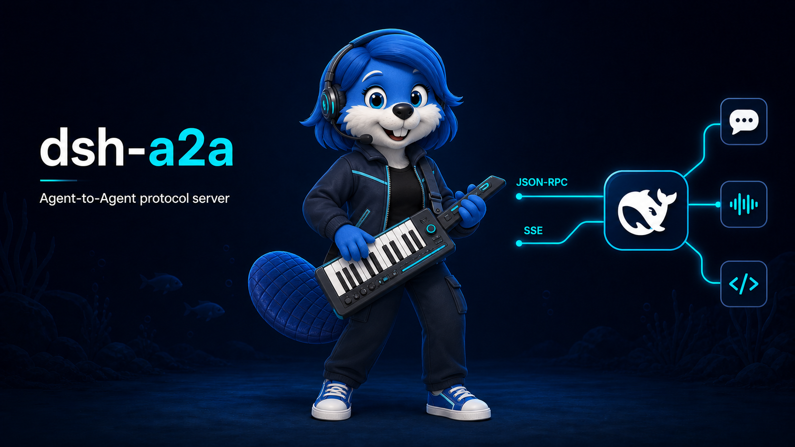

# @amaster.ai/dsh-a2a



A2A protocol server plugin for [DeepSeek Harness (dsh)](https://github.com/deepseek-ai/deepseek-harness): expose dsh agents as [A2A](https://github.com/a2aproject) agents — streaming turns, task cancel, agent card, and pluggable task-state stores. Speaks **A2A 1.0** (JSON-RPC + SSE) on [`@a2a-js/sdk`](https://github.com/a2aproject/a2a-js) 1.x, with the SDK's opt-in **v0.3 compatibility layer** kept on so pre-1.0 clients keep working. Ported from the source project's `packages/a2a-server`.

`dsh-a2a` is the network boundary for a dsh agent. It gives A2A clients a stable task-oriented interface while the agent continues to use the profile's models, presets, tools, and workspace rules.

## Install

```sh
dsh plugin --profile my-agent add @amaster.ai/dsh-a2a
```

## Configuration

Disabled by default. Configure via the profile's `cordis.patch.yml`:

```yaml
- insert:
    - id: a2a
      name: '@amaster.ai/dsh-a2a'
      config:
        enabled: true
        host: 127.0.0.1        # no auth built in — keep loopback or front with a proxy
        port: 41241
        basePath: /a2a
        cwd: /srv/agent-workspaces
        agent:
          provider: ''       # dsh provider/model for A2A sessions; empty = profile default
          model: ''
          preset: ''         # agent preset mounted per task; empty = deployment default
        card:
          name: my-agent
          description: My dsh agent over A2A
          version: 0.1.0
          publicUrl: https://agent.example.com
        taskStore: redis       # memory | redis | gcs
        redis:
          url: redis://127.0.0.1:6379
          keyPrefix: a2a
          ttlSeconds: 86400
        gcs:
          bucket: my-agent-archives
          prefix: tasks
          keyFilename: ''      # GOOGLE_APPLICATION_CREDENTIALS path; empty = ADC
```

## Endpoints

- `GET /.well-known/agent-card.json` — agent card: A2A 1.0 shape for `A2A-Version: 1.0` clients, the 0.3 shape for headerless clients (the legacy `/.well-known/agent.json` path is served as an alias)
- `POST <basePath>/` — JSON-RPC. v1 methods: `SendMessage` (blocking by default, `configuration.returnImmediately: true` returns after the first event), `SendStreamingMessage` (SSE), `GetTask`, `ListTasks` (filter + cursor pagination), `CancelTask`, `SubscribeToTask` (the current task is the first event; the bus stays alive while the task is interrupted, so interrupted tasks can be re-followed live). v0.3 spellings (`message/send`, `message/stream`, `tasks/get`, `tasks/cancel`, `tasks/resubscribe`) keep working through the compat layer.

## Behavior notes

- **One task = one dsh session.** The A2A `contextId` IS the dsh session id. A completed turn ends `input-required`, not `completed` — the task is a conversation and stays continuable; `CancelTask` and turn errors are terminal (`canceled` / `failed`), and the SDK rejects follow-ups addressed at a terminal `taskId` (send with only the `contextId` to continue the session under a fresh task id).
- **Agents are full preset citizens.** Each task's agent is created with the deployment's default model selection (`agentDefaultModel`) and mounts its agent preset (the web profile keeps all tools inside presets — without one the agent would see an empty tool catalog). `agent.preset` pins a specific preset.
- **Streaming aggregation.** Text deltas of a turn share one `messageId`, so clients accumulate them into a single message; reasoning deltas ride a separate `messageId` and are marked `metadata.dshAgent.kind: 'thought'`. The turn-final event's message carries the full assembled text, so blocking `SendMessage` clients read the answer from `result.task.status.message`. Tool calls/results are data parts marked `tool-call` / `tool-result`; token usage lands in `metadata.usage` of the final event. A2A 1.0 has no `final` flag — terminal and interrupted states close the stream.
- **Text-only boundary** for now: `SendMessage` rejects messages with non-text parts (file/url/data) with a failed task.
- **No approval bridge**: dsh 0.1.2 ships the mid-turn approval seam only as the optional `dsh-user-approval` package, which headless profiles do not compose, so tools that would ask are governed by the profile's own approval setup; the A2A side never enters a mid-turn `input-required`.
- **One in-flight message per task** is the supported flow (send the next message after the turn-final event). dsh serializes queued follow-ups into successive turns, but concurrent requests share one event bus — a second in-flight request may resolve with the first turn's final event.
- **Restart**: persisted task shells survive in Redis/GCS, but live agents do not — continuing after a restart starts a fresh session (a client-supplied `contextId` names it).

## Task stores

A2A **task state** (status + metadata) is separate from conversation history — use [dsh-storage](../dsh-storage) for the latter. Every backend persists a sanitized metadata shell (history/artifacts stripped) and saves only on task-state transitions, so token-rate stream events never reach the backend.

- `memory` (default) — in-process, lost on restart
- `redis` — task JSON under `<keyPrefix>:tasks:<taskId>` with a TTL; requires the `ioredis` peer
- `gcs` — gzipped task JSON at `<prefix>/<taskId>/metadata.json.gz` (same layout as the source project's `GCSTaskStore`); requires the `@google-cloud/storage` peer. `archiveWorkspace()` (tar of the workspace) exists but is not wired to the lifecycle yet.

## Security

dsh ships **no authentication or authorization**. The server binds `127.0.0.1` by default; if you expose it, put an authenticated reverse proxy in front and treat every agent as running with the host process's OS privileges.

## Compatibility

Pinned dsh/cordis versions live in the [root compat matrix](../../README.md#compatibility). Event payloads ride pre-release dsh APIs (`@deepseek-ai/dsh-{agent,session,llm}@0.1.2-rc.1`) — check the `TODO(verify)` markers in `src/` before upgrading dsh.

## License

MIT
