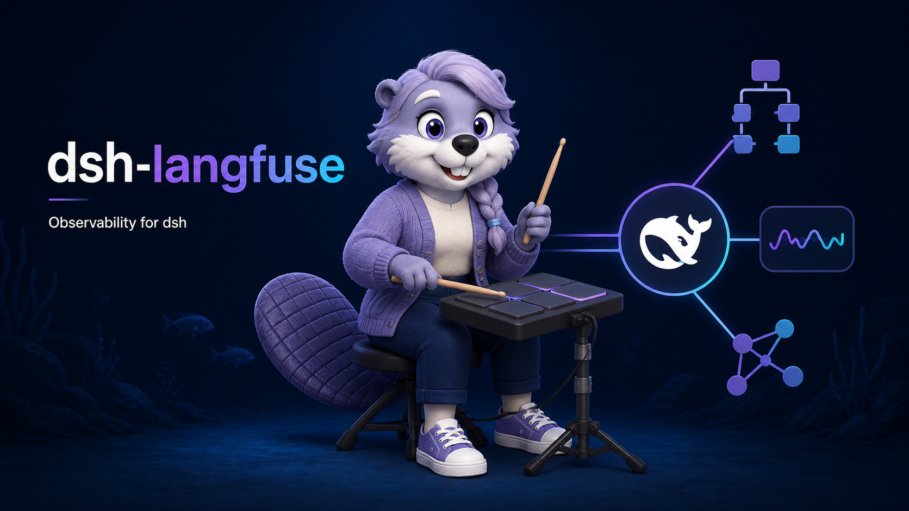

# @amaster.ai/dsh-langfuse



Langfuse observability for [DeepSeek Harness (dsh)](https://github.com/deepseek-ai/deepseek-harness):

- one **generation** per LLM call (`llm/stream` waterfall), plus a nested `llm-request` span carrying the verbatim loop-built request
- one **span** per tool call (`tools/execute` waterfall)
- one **span** per `hook/invoked` / `hook/result` pair, with hook point, decision, exit code, and duration (stderr summary follows `captureContent`)
- one **trace** per session turn (`session/event`) — in the v5 SDK the trace IS its root span, ended (and thereby exported) at `turn/end`
- subagent child sessions nested under the parent's tree (`session/created` header link + `subagent/start` / `subagent/end`)

## Install

```sh
dsh plugin --profile my-agent add @amaster.ai/dsh-langfuse \
  @langfuse/tracing @langfuse/otel @opentelemetry/sdk-trace-node \
  @opentelemetry/api @opentelemetry/exporter-trace-otlp-http
```

The Langfuse JS SDK v5 peers (`@langfuse/tracing`, `@langfuse/otel`, `@opentelemetry/sdk-trace-node`) are loaded via lazy dynamic `import()`, so an unused install costs nothing — but they must all be present at runtime (`dsh plugin add` does not auto-install peer trees, so the OTEL api/exporter packages `@langfuse/otel` itself peers on are listed explicitly).

## Configuration

Disabled by default. Configure via the profile's `cordis.patch.yml`:

```yaml
- insert:
    - id: langfuse
      name: '@amaster.ai/dsh-langfuse'
      config:
        enabled: true
        publicKey: pk-lf-...
        secretKey: sk-lf-...            # secret role
        baseUrl: https://cloud.langfuse.com
        traceName: dsh-turn
        captureContent: true            # set false to record metadata only
```

Buffered spans drain on `session/flush(session)`; the exporter shuts down with the plugin fiber.

With `captureContent: true`, both `llm-call` and `llm-request` inputs contain every `llm/stream` request option except the non-serializable `AbortSignal`. New request fields pass through without a plugin update. Langfuse's separate generation `modelParameters` attribute summarizes the known sampling fields; it is not part of either request input. These are dsh-side values, not exact provider HTTP payloads: adapters may add defaults, project messages/tools, or rename fields after this seam. With `captureContent: false`, inputs keep structural counts while the separate `modelParameters` attribute keeps safe parameter metadata.

Hook spans appear when a dsh hook bridge emits the paired session records. The current `hook/result` record does not contain stdout; successful script output can appear in the LLM request when the bridge injects it as context, while the hook span reports decision, exit code, duration, and bounded stderr. `SessionStart` runs before the first turn and does not emit these records, so it has no hook span.

Observability is a no-throw seam: backend errors are logged with a `[dsh-langfuse]` prefix and never escape into the agent loop.

## Compatibility

Pinned dsh/cordis versions live in the [root compat matrix](../../README.md#compatibility). Event payloads ride pre-release dsh APIs — check the `TODO(verify)` markers in `src/` before upgrading dsh.

## License

MIT
